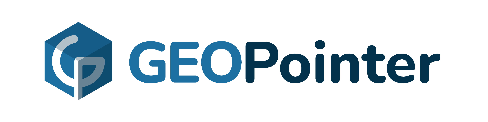

# Teste Front-end

Neste teste serão avaliados seus conhecimentos em Javascript, HTML, CSS, banco de dados, API REST, arquitetura e organização da aplicação final.

## O Desafio

Você é o desenvolvedor fullstack de uma empresa de engenharia que irá realizar o mapeamento dos equipamentos presentes em uma industria. No mapeamento dos equipamentos, será coletado os dados da tag de identificação do equipamento, a data da ultima manuntenção, a posição geográfica do equipamento e o tipo do equipamento.

Seu objetivo é, de posse desses dados, desenvolver uma aplicação backend que exponha esses dados através de uma API e uma interface que exiba essas informações para os gestores da industria.

## Requisitos

Esses requisitos são obrigatórios e devem ser desenvolvidos para a entrega do teste.

* **API de CRUD**: Você deve desenvolver uma API que exponha os métodos de Criar, Excluir, Editar e Ler para a entidade equipamento.

* **Tabela de visualização do dado**: Visualizar uma tabela com todas os equipamentos

## O que é permitido

* Vue, React e Angular.

* Typescript.

* Bibliotecas de componentes (Element-ui, Vuetify, Bootstrap, etc.)

* Bibliotecas e APIs de Mapas (Leaflet, Openlayers, Google Maps API, etc).

* Template engines (Pug, Ejs, etc).

* Gerenciamento de estado (Vuex, Redux, etc).

* Frameworks CSS (Tailwind, Bulma, Bootstrap, Materialize, etc).

* Pré-processadores CSS (SCSS, SASS, LESS, etc).

* C# (.NET, .NET Core, etc).

* Express.js.

* Mapeamento objeto-relacional (ORM).

* Qualquer tecnologia complementar as citadas anteriormente são permitidas desde que seu uso seja justificável.

## O que não é permitido

* Utilizar componentes ou códigos de terceiros que implementem algum dos requisitos.

## Extras

Aqui são listados algumas sugestões para você que quer ir além do desafio inicial. Lembrando que você não precisa se limitar a essas sugestões, se tiver pensado em outra funcionalidade que considera relevante ao escopo da aplicação fique à vontade para implementá-la.

* **Posicionar equipamentos no mapa**: Exibir em um mapa os equipamentos nas suas posições.

* **Filtros**: Filtrar as visualizações por uma propriedade de um equipamento.

* **Pesquisa**: Ser possível pesquisar por dados de um equipamento especifico.

* **Testes**: Desenvolva testes que achar necessário para a aplicação, seja testes unitários, testes automatizados, testes de acessibilidade, etc.

* **Documentação**: Gerar uma documentação da aplicação. A documentação pode incluir detalhes sobre as decisões tomadas, especificação dos componentes desenvolvidos, documentação da API desenvolvida, instruções de uso dentre outras informações que achar relevantes.

## Entregas

Para realizar a entrega do teste você deve:

* Relizar o fork e clonar esse repositório para sua máquina.
  
* Criar uma branch com o nome de `teste/[NOME]`.
  * `[NOME]`: Seu nome.
  * Exemplos: `teste/fulano-da-silva`; `teste/beltrano-primeiro-gomes`.
  
* Faça um commit da sua branch com a implementação do teste.
  
* Realize o pull request da sua branch nesse repositório.